# Real-Time Task Board

A collaborative, real-time task management application where multiple users can create, update, and delete tasks and see changes instantly—no page refresh required.

---

## Table of Contents

1. [Features](#features)
2. [Tech Stack](#tech-stack)
3. [Architecture Flow](#architecture-flow)
4. [Prerequisites](#prerequisites)
5. [Setup](#setup)
   - [Clone the Repository](#clone-the-repository)
   - [Backend](#backend)
   - [Frontend](#frontend)
6. [Environment Variables](#environment-variables)
7. [Running the App](#running-the-app)
8. [API Endpoints](#api-endpoints)
9. [Project Structure](#project-structure)
10. [License](#license)

---

## Features

- **Real-Time Updates**: Tasks are synced live across all connected clients via WebSockets and MongoDB Change Streams.
- **CRUD Operations**: Create, read, update, and delete tasks with a clean REST API.
- **Search & Filter**: Quickly find tasks by title or description.
- **Responsive UI**: Modern React interface with Tailwind CSS and Framer Motion animations.
- **Notifications**: Toast notifications for task events (add/update/delete).

---

## Tech Stack

| Layer      | Technology                            |
|------------|---------------------------------------|
| Backend    | Go · Gin · MongoDB · Gorilla WebSocket |
| Frontend   | React · Vite · TypeScript · Tailwind CSS · Framer Motion · react-hot-toast |
| Database   | MongoDB                               |

---

## Architecture Flow

```mermaid
flowchart LR
  subgraph Frontend
    A[React UI] -->|REST| B(Go HTTP Server)
    A -->|WS| C(Go WebSocket Server)
  end

  subgraph Backend
    B --> D[MongoDB]
    C --> E[WebSocket Hub]
    D -->|Change Streams| E
    E -->|Broadcast| C
  end

  %% Group Styles
  style Frontend fill:#1e1e2e,stroke:#89dceb,stroke-width:2px
  style Backend fill:#1e1e2e,stroke:#f38ba8,stroke-width:2px

  %% Node Styles
  style A fill:#89b4fa,stroke:#1e1e2e,stroke-width:2px,color:#1e1e2e,rx:8,ry:8
  style B fill:#a6e3a1,stroke:#1e1e2e,stroke-width:2px,color:#1e1e2e,rx:8,ry:8
  style C fill:#94e2d5,stroke:#1e1e2e,stroke-width:2px,color:#1e1e2e,rx:8,ry:8
  style D fill:#f9e2af,stroke:#1e1e2e,stroke-width:2px,color:#1e1e2e,rx:8,ry:8
  style E fill:#f5c2e7,stroke:#1e1e2e,stroke-width:2px,color:#1e1e2e,rx:8,ry:8

  %% Link Style (optional)
  linkStyle default stroke:#fab387,stroke-width:2px
```  



---

## Prerequisites

- **Go** ≥1.18 installed and on your `$PATH`.
- **Node.js** ≥14 (with npm or yarn).
- **MongoDB** running locally (`mongodb://localhost:27017`) or accessible via a remote URI.

---

## Setup

### Clone the Repository

```bash
git clone https://github.com/asmit27rai/real-time-taskboard.git
cd real-time-taskboard
```

### Backend

```bash
cd backend

# (Optional) Create .env file or export vars
# MONGO_URI and PORT (defaults to 8080)

go mod tidy        # Install Go dependencies

go run ./cmd/server  # Start the Go server
```

### Frontend

```bash
cd frontend

# Install JS dependencies
npm install       # or yarn install

# Create .env (see below)

npm run dev       # Start Vite dev server (default http://localhost:5173)
```

---

## Environment Variables

| Name            | Description                          | Default                     |
|-----------------|--------------------------------------|-----------------------------|
| MONGO_URI       | MongoDB connection string            | `mongodb://localhost:27017`|
| PORT            | Backend HTTP/WebSocket port          | `8080`                      |
| VITE_API_BASE   | Base URL for REST API                | `http://localhost:8080`     |
| VITE_WS_URL     | WebSocket endpoint URL               | `ws://localhost:8080/ws`    |
| VITE_CLERK_PUBLISHABLE_KEY     | Authetication               | `none`    |

---

## Running the App

1. **Start MongoDB** (if not already running).
2. **Run Backend**:
   ```bash
   cd backend
   go run ./cmd/server
   ```
3. **Run Frontend**:
   ```bash
   cd frontend
   npm run dev
   ```
4. Open `http://localhost:5173` in your browser and start collaborating!

---

## API Endpoints

| Method | Endpoint     | Description             |
|--------|--------------|-------------------------|
| GET    | `/tasks`     | List all tasks          |
| POST   | `/tasks`     | Create a new task       |
| PUT    | `/tasks/:id` | Update an existing task |
| DELETE | `/tasks/:id` | Delete a task           |
| GET    | `/ws`        | WebSocket endpoint      |

---

## Project Structure

```
real-time-taskboard/
├── backend/               # Go service
│   ├── cmd/server/        # main.go (entry point)
│   ├── internal/
│   │   ├── api/           # REST handlers
│   │   ├── db/            # MongoDB connection & watcher
│   │   ├── models/        # Data models
│   │   └── ws/            # WebSocket hub & clients
│   ├── go.mod
│   └── go.sum
└── frontend/              # React + Vite app
    ├── public/
    ├── src/
    │   ├── components/    # UI components
    │   ├── services/      # API & WebSocket
    │   ├── App.tsx        # Root component
    │   └── main.tsx       # Entry point
    ├── package.json
    └── vite.config.ts
```
